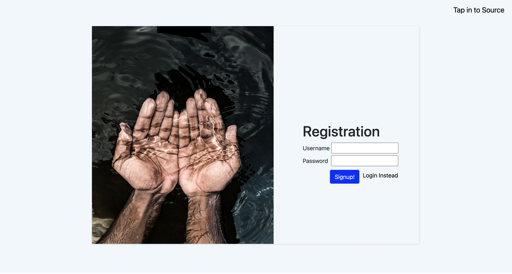
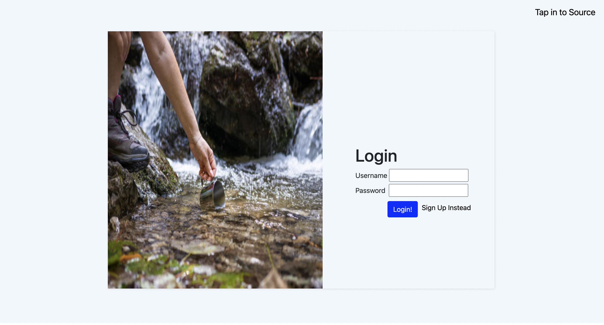
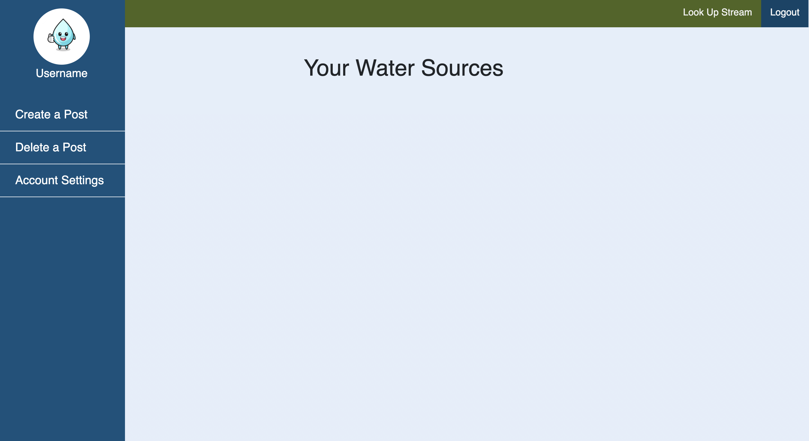
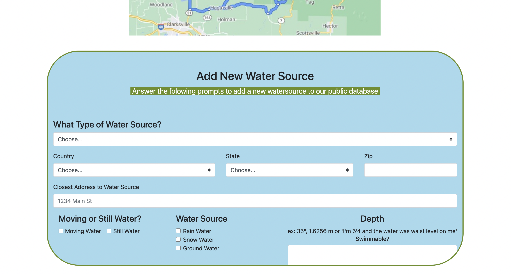
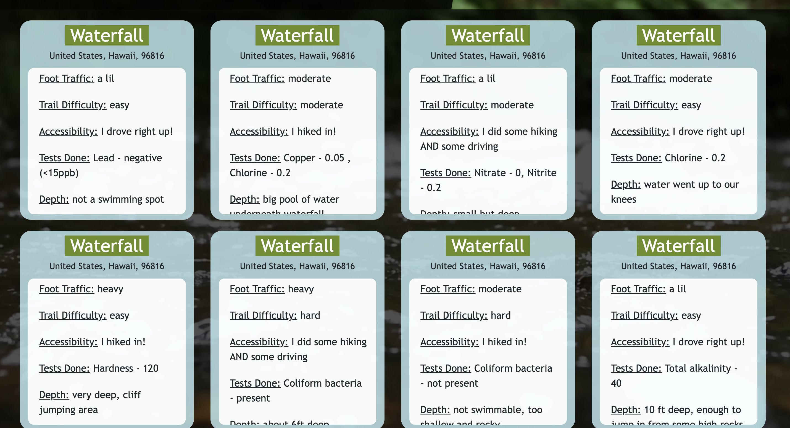

#Tap Into Source

Application built to help users save and share their favorite water sources.

##Description
We created an application as a way to help users save and share their favorite bodies of water.
In the application users will be able to easily save identifiers for future use such as: location, type of water source,accessibility, the tests that have been run (which would decipher its safety and drinkability), and so forth.
Posts will be saved to the users profile and will be available to be filtered through with the assist of user selected tags. We utilized Node.js, sequelize and Express.js to create a RESTful API. We also utilized FontAwesome, Jquery, Bootstrap and vanilla Javascript for our front end.

##Screenshots

###Links
Deployed Site URL: https://tap-into-source.herokuapp.com/

####Contributors
Jacqueline - https://github.com/JacquelineHockin 
Haley - https://github.com/haleymay21
Chase - https://github.com/chasebinkley
Lamar - https://github.com/lmartin214

#####Acknowledgments
Shout out to Elon Musk for single handedly destroying Twitter.

